# Nest Finder — Diagrams

All diagrams for the Nest Finder app (Expo React Native + Supabase) in one file: full app flowchart, per-flow sequence diagrams, ER diagram, class diagram, use-case diagram, and the database tables.

---

## 1. Full App Flowchart

One flowchart for the whole app. Shape legend:

| Shape | Meaning |
| --- | --- |
| `[ box ]` | Process / action |
| `{ diamond }` | Decision (Yes / No) |
| `[ / box / ]` | Input / output (user input, screen output) |
| `( [ stadium ] )` | Start / End |
| `( ( database ) )` | Database |

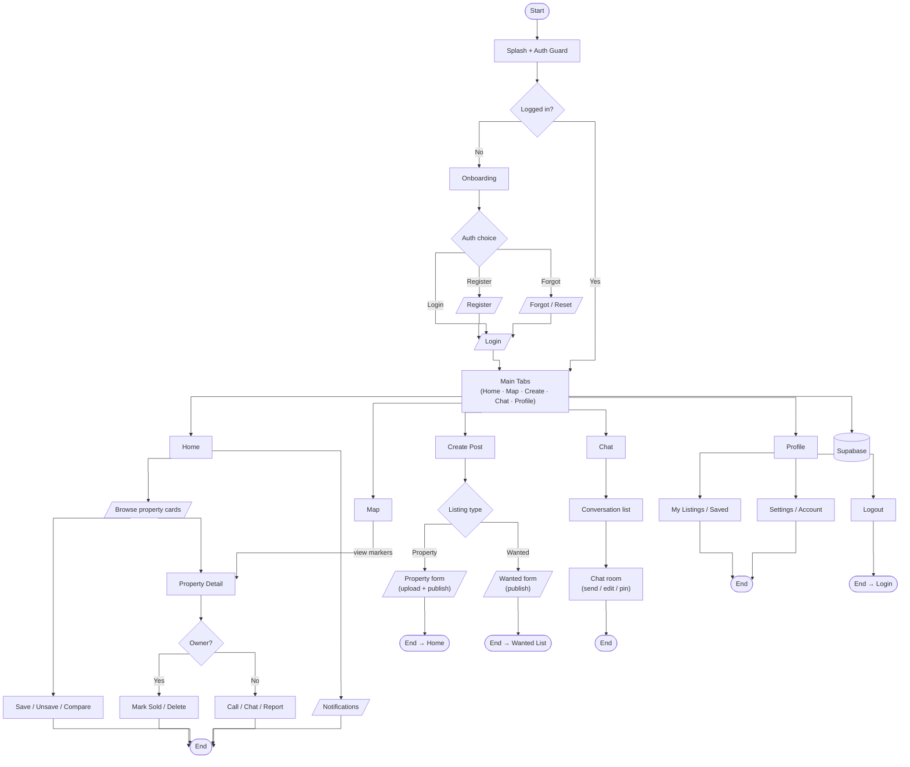

---

## 2. Sequence Diagrams

Domain sequence diagrams, one per group of use cases from the Use-Case Diagram (Section 5). Participants are the Supabase domain entities from the ER diagram (Section 3), not UI screens.

### 2.1 Auth — "Login / Register"

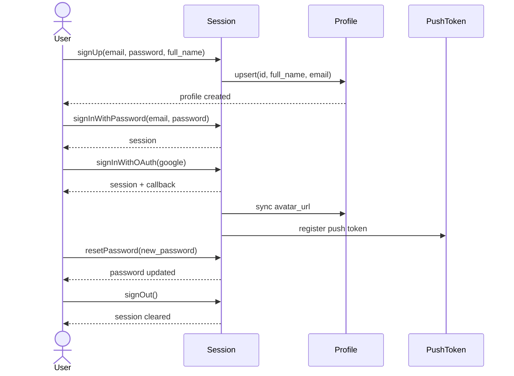

### 2.2 Browse, Save & Compare — "Browse / search properties" · "Save / unsave properties" · "Compare properties"

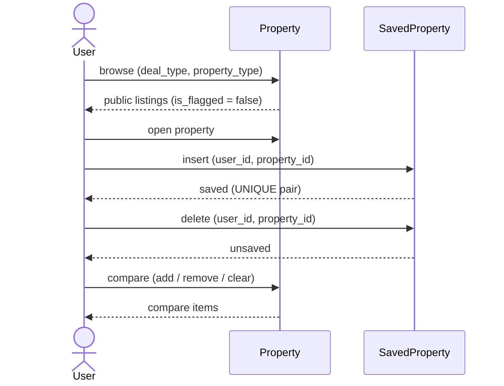

### 2.3 Search & Map — "Search properties" · "View map markers" · "View property detail"

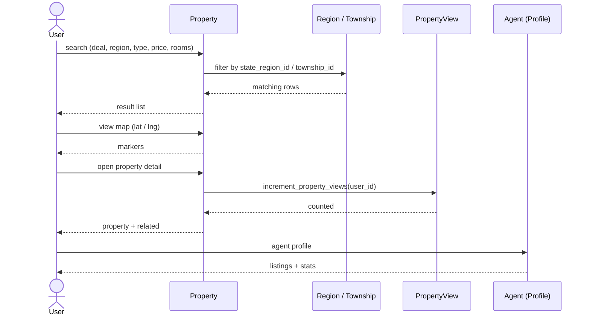

### 2.4 Property Detail — "View property detail" · "Call agent" · "Flag & report listing" · "Mark sold / delete"

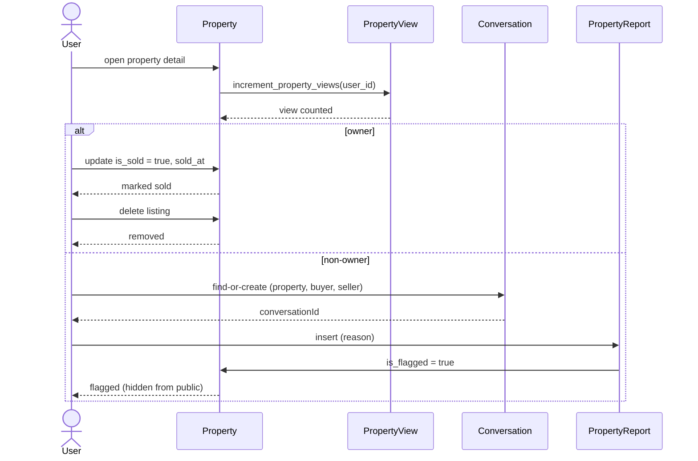

### 2.5 Create Post — "Post property listing" · "Post hostel listing" · "Post wanted listing"

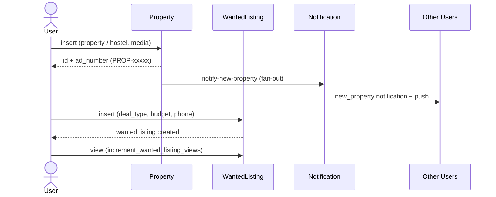

### 2.6 Chat — "Chat with agent / seller" · "Respond via chat" · "Receive notifications"

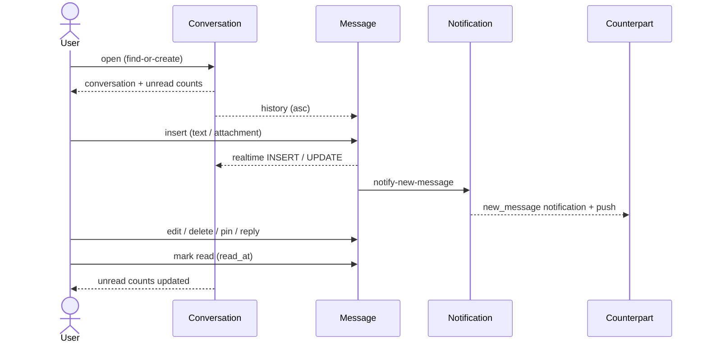

### 2.7 Profile, My Listings & Notifications — "Manage My Listings" · "Manage profile & settings" · "Receive notifications"

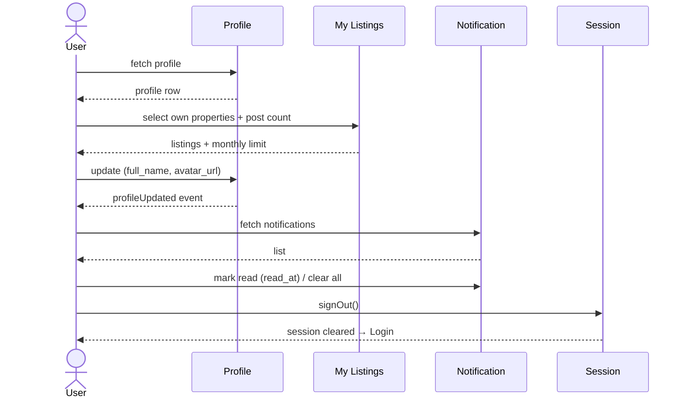

### 2.8 Seller Process — "Post property listing" · "Post hostel listing" · "Manage My Listings" · "Mark sold / delete" · "Respond via chat"

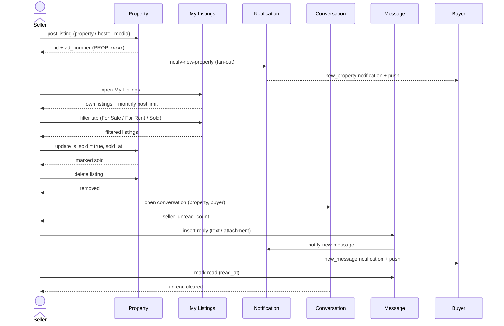

Frontend-focused sequence diagrams for each flow in the flowchart, showing the screens the user interacts with and the key Supabase calls. The database is shown as a single participant per flow.

## 3. ER Diagram (Supabase Database)

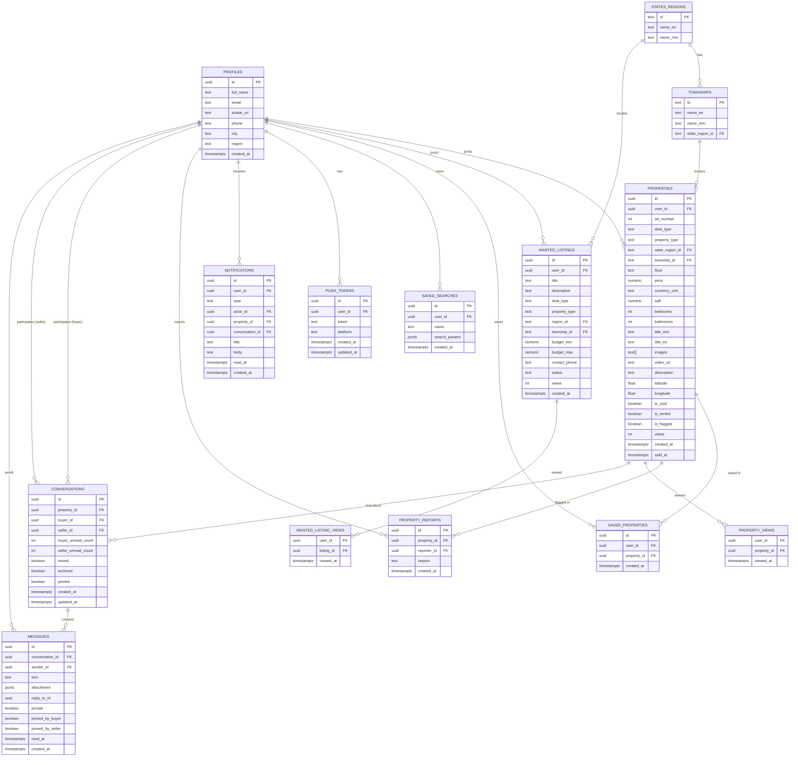

---

## 4. Class Diagram (Supabase Tables)

Class representation of the Supabase database tables — the same schema as the ER diagram (Section 3) — with each table's columns as class attributes and the PK/FK associations between them.

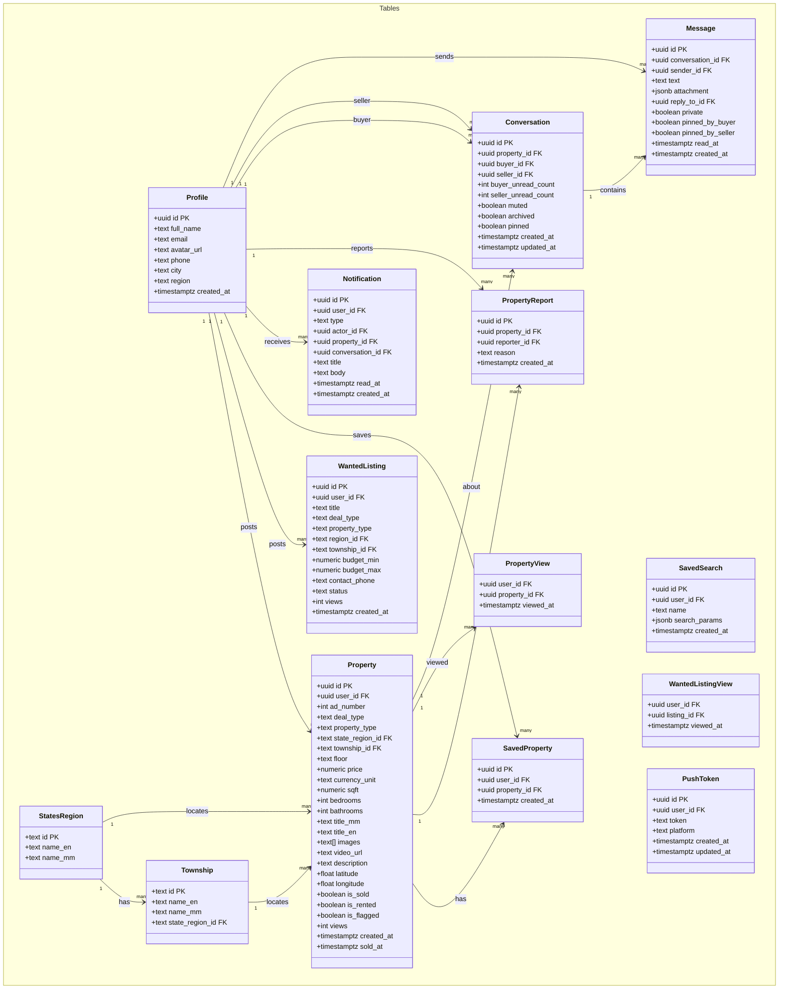

## 5. Use-Case Diagram

Mermaid has no native use-case diagram, so this uses a flowchart with actor nodes and use-case ellipses inside the system boundary.

```mermaid
flowchart LR
    subgraph SYSTEM["📱 Nest Finder App (system boundary)"]
        direction TB
        subgraph G1["Guest use cases"]
            U1(("🔍 Browse / search properties"))
            U2(("🗺️ View map markers"))
            U3(("📄 View property detail"))
            U4(("🔑 Login / Register"))
        end
        subgraph G2["Buyer use cases"]
            U5(("💾 Save / unsave properties"))
            U6(("⚖️ Compare properties"))
            U7(("💬 Chat with agent / seller"))
            U8(("📞 Call agent"))
            U9(("🚩 Flag & report listing"))
            U10(("📋 Post wanted listing"))
            U11(("🔔 Receive notifications"))
        end
        subgraph G3["Owner / Seller use cases"]
            U12(("🏠 Post property listing"))
            U13(("🏢 Post hostel listing"))
            U14(("📂 Manage My Listings"))
            U15(("✅ Mark sold / delete"))
            U16(("💬 Respond via chat"))
        end
        subgraph G4["Any-user use cases"]
            U17(("🛠️ Manage profile & settings"))
            U18(("🌐 Switch language (EN / MM)"))
        end
    end
    A1(["👤 Guest"]) --> U1
    A1 --> U2
    A1 --> U3
    A1 --> U4
    A2(["👤 Buyer"]) --> U5
    A2 --> U6
    A2 --> U7
    A2 --> U8
    A2 --> U9
    A2 --> U10
    A2 --> U11
    A3(["👤 Owner / Seller"]) --> U12
    A3 --> U13
    A3 --> U14
    A3 --> U15
    A3 --> U16
    A4(["👤 Any user"]) --> U17
    A4 --> U18
```

---

## 6. Database Tables

Enums: `deal_type` (`sale`, `rent`, `buy`, `launch`, `building`), `wanted.deal_type` (`buy`, `rent`), `wanted.status` (`active`, `filled`, `expired`).

### profiles

| Column | Type | Constraints |
| --- | --- | --- |
| id | uuid | PK → auth.users(id) |
| full_name | text | |
| email | text | |
| avatar_url | text | |
| phone | text | |
| city | text | |
| region | text | |
| created_at | timestamptz | default now() |

### properties

| Column | Type | Constraints |
| --- | --- | --- |
| id | uuid | PK |
| user_id | uuid | FK → profiles(id) |
| ad_number | int | server sequence → `PROP-{10000 + ad_number}` |
| deal_type | text | `sale` / `rent` / `launch` / `building` |
| property_type | text | `condo` / `apartment` / `house` / `land` / `hostel` |
| state_region_id | text | FK → states_regions(id) |
| township_id | text | FK → townships(id) |
| floor | text | |
| price | numeric | |
| currency_unit | text | |
| sqft | numeric | |
| bedrooms | int | |
| bathrooms | int | |
| title_mm | text | |
| title_en | text | |
| images | text[] | |
| video_url | text | |
| description | text | |
| latitude / longitude | float | |
| is_sold | boolean | |
| is_rented | boolean | |
| is_flagged | boolean | default false |
| views | int | |
| created_at | timestamptz | default now() |
| sold_at | timestamptz | |

### wanted_listings

| Column | Type | Constraints |
| --- | --- | --- |
| id | uuid | PK |
| user_id | uuid | FK → profiles(id) |
| title | text | |
| description | text | |
| deal_type | text | check `buy` / `rent` |
| property_type | text | |
| region_id | text | FK → states_regions(id) |
| township_id | text | FK → townships(id) |
| budget_min / budget_max | numeric | |
| contact_phone | text | |
| status | text | check `active` / `filled` / `expired` |
| views | int | |
| created_at | timestamptz | default now() |

### conversations

| Column | Type | Constraints |
| --- | --- | --- |
| id | uuid | PK |
| property_id | uuid | FK → properties(id) |
| buyer_id | uuid | FK → profiles(id) |
| seller_id | uuid | FK → profiles(id) |
| buyer_unread_count | int | |
| seller_unread_count | int | |
| muted | boolean | |
| archived | boolean | |
| pinned | boolean | |
| created_at / updated_at | timestamptz | |

### messages

| Column | Type | Constraints |
| --- | --- | --- |
| id | uuid | PK |
| conversation_id | uuid | FK → conversations(id) |
| sender_id | uuid | FK → profiles(id) |
| text | text | |
| attachment | jsonb | `{url, type, name, size}` |
| reply_to_id | uuid | FK → messages(id) |
| private | boolean | |
| pinned_by_buyer / pinned_by_seller | boolean | |
| read_at | timestamptz | |
| created_at | timestamptz | default now() |

### notifications

| Column | Type | Constraints |
| --- | --- | --- |
| id | uuid | PK |
| user_id | uuid | FK → profiles(id) |
| type | text | `new_property` / `new_message` |
| actor_id | uuid | FK → profiles(id) |
| property_id | uuid | FK → properties(id) |
| conversation_id | uuid | FK → conversations(id) |
| title / body | text | |
| read_at | timestamptz | null = unread |
| created_at | timestamptz | default now() |

### saved_properties

| Column | Type | Constraints |
| --- | --- | --- |
| id | uuid | PK |
| user_id | uuid | FK → profiles(id) |
| property_id | uuid | FK → properties(id) |
| created_at | timestamptz | default now() |
| — | — | UNIQUE (user_id, property_id) |

### saved_searches

| Column | Type | Constraints |
| --- | --- | --- |
| id | uuid | PK |
| user_id | uuid | FK → profiles(id) |
| name | text | |
| search_params | jsonb | |
| created_at | timestamptz | default now() |

### property_views

| Column | Type | Constraints |
| --- | --- | --- |
| user_id | uuid | FK → profiles(id) |
| property_id | uuid | FK → properties(id) |
| viewed_at | timestamptz | |
| — | — | PK (user_id, property_id) |

### wanted_listing_views

| Column | Type | Constraints |
| --- | --- | --- |
| user_id | uuid | FK → profiles(id) |
| listing_id | uuid | FK → wanted_listings(id) |
| viewed_at | timestamptz | |
| — | — | PK (user_id, listing_id) |

### property_reports

| Column | Type | Constraints |
| --- | --- | --- |
| id | uuid | PK |
| property_id | uuid | FK → properties(id) |
| reporter_id | uuid | FK → profiles(id) |
| reason | text | `spam` / `misleading` / `off_topic` / `other` |
| created_at | timestamptz | default now() |

### push_tokens

| Column | Type | Constraints |
| --- | --- | --- |
| id | uuid | PK |
| user_id | uuid | FK → profiles(id) |
| token | text | Expo push token |
| platform | text | |
| created_at / updated_at | timestamptz | |

### states_regions

| Column | Type | Constraints |
| --- | --- | --- |
| id | text | PK |
| name_en | text | |
| name_mm | text | |

### townships

| Column | Type | Constraints |
| --- | --- | --- |
| id | text | PK |
| name_en | text | |
| name_mm | text | |
| state_region_id | text | FK → states_regions(id) |

---

## Notes

- **Tech stack**: Expo SDK 54, expo-router v6 (file-based routing), NativeWind v4 (Tailwind), gluestack-ui, react-i18next (en + mm), @shopify/flash-list, react-native-webview (Leaflet map), Supabase (auth, Postgres, Storage, Realtime).
- **Auth guard**: App launch → `index.tsx` checks `supabase.auth.getUser()` → redirects to `(tabs)` or onboarding. Guests may still browse (Save/Chat/Create require login).
- **RLS model**: Most tables enforce `auth.uid()` ownership; properties are publicly readable (except flagged), writes restricted to owner.
- **Flagged listings**: `property_reports` sets `is_flagged = true`; all public queries filter `is_flagged = false`. Owners still see their own in My Listings.
- **Notifications**: DB triggers `notify_new_property` (fan-out to all other users) and `notify_new_message` (to conversation counterpart) insert into `notifications`; client additionally fires `notify-new-property` / `send-notification` edge functions for Expo push.
- **Views**: `increment_property_views` / `increment_wanted_listing_views` count each logged-in user once (owner's own views are skipped); anonymous views increment directly.
- **Monthly post limit**: `get_monthly_post_count` + `can_user_post` RPCs enforce 5 property/hostel posts per month (wanted posts are not limited).
