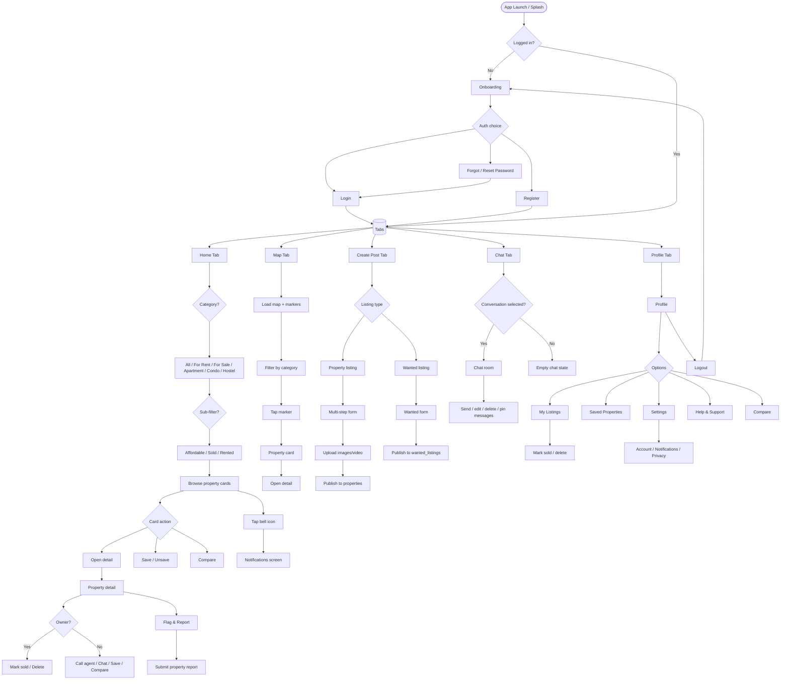
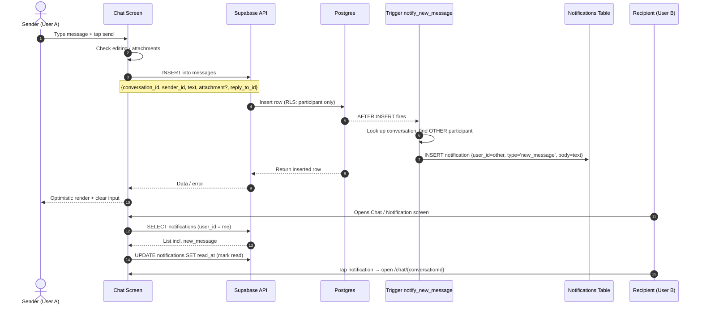
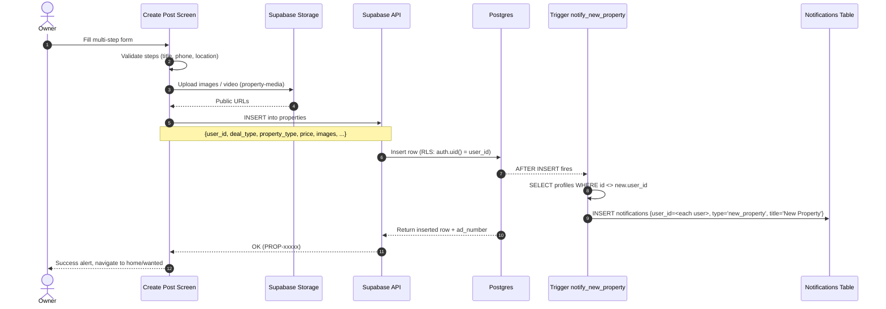
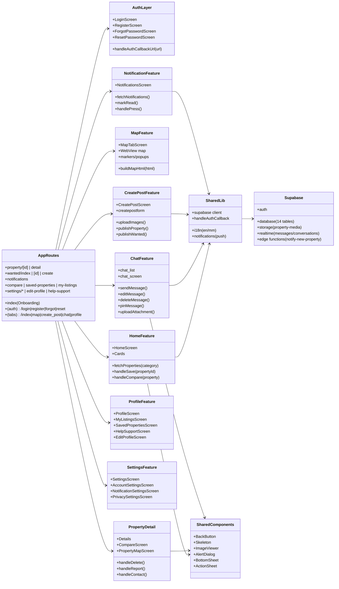
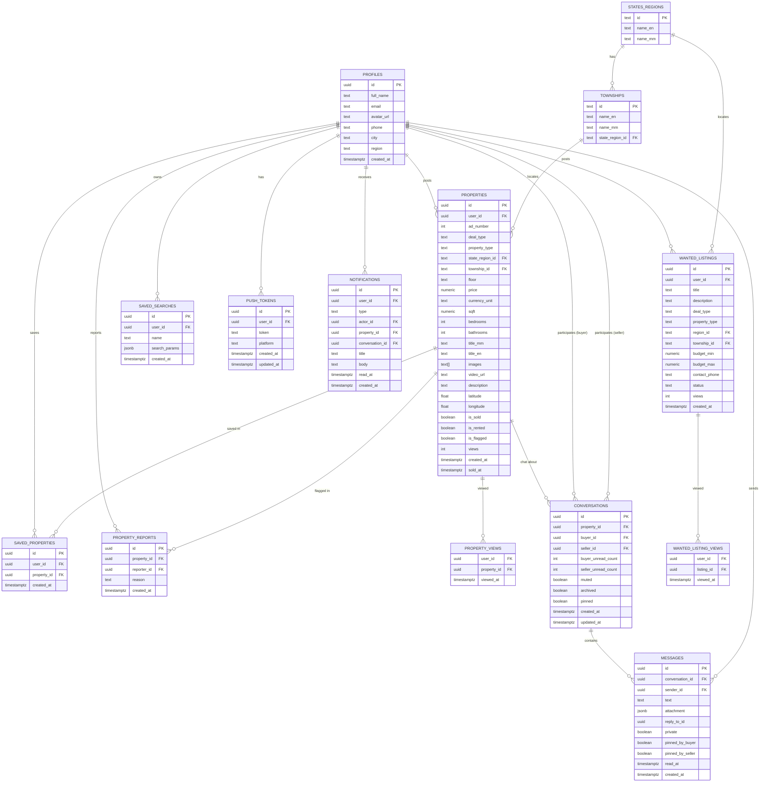

# Nest Finder — Application Diagrams

Expo React Native (expo-router) + Supabase app for property listing, search, chat, and notifications.

---

## 1. Flow Chart (App Navigation & User Flow)

---

## 2. Sequence Diagram — Send a Chat Message with Notifications

---

## 3. Sequence Diagram — Publish a Property + Broadcast Notifications

---

## 4. Class Diagram (App Components / Modules)

---

## 5. ER Diagram (Supabase Database)

---

## 6. Use Case Diagram

```mermaid
flowchart TB
    subgraph Guest["Guest (unauthenticated)"]
        GU1[Browse properties]
        GU2[Search / filter properties]
        GU3[View map markers]
        GU4[View property detail]
        GU5[Login / Register]
        GU6[Forgot / Reset password]
    end

    subgraph User["Registered User"]
        U1[Post property listing]
        U2[Post wanted listing]
        U3[Chat with agents / sellers]
        U4[Send images in chat]
        U5[Save / unsave properties]
        U6[Compare properties]
        U7[Report a listing]
        U8[Receive notifications]
        U9[View notifications]
        U10[Manage My Listings]
        U11[Mark listing as sold]
        U12[Delete listing]
        U13[Manage profile & settings]
        U14[Call agent directly]
        U15[View saved properties]
        U16[Track post limit]
    end

    subgraph System["Supabase Backend"]
        S1[RLS policies]
        S2[Realtime channels]
        S3[View counters]
        S4[Unread counts]
        S5[Notification triggers]
        S6[Storage uploads]
    end

    Guest --> GU1
    Guest --> GU2
    Guest --> GU3
    Guest --> GU4
    Guest --> GU5
    Guest --> GU6

    User --> U1
    User --> U2
    User --> U3
    User --> U4
    User --> U5
    User --> U6
    User --> U7
    User --> U8
    User --> U9
    User --> U10
    User --> U10
    User --> U11
    User --> U12
    User --> U13
    User --> U14
    User --> U15
    User --> U16

    U1 --> S6
    U4 --> S6
    U3 --> S2
    U9 --> S5
    U3 --> S4
    U1 --> S1
    GU4 --> S1
    GU1 --> S3
```

---

## Notes

- **Tech stack**: Expo SDK 54, expo-router v6 (file-based routing), NativeWind v4 (Tailwind), gluestack-ui, react-i18next (en + mm), @shopify/flash-list, react-native-webview (Leaflet map), Supabase (auth, Postgres, Storage, Realtime).
- **Auth guard**: App launch → `index.tsx` checks `supabase.auth.getUser()` → redirects to `(tabs)` or onboarding.
- **RLS model**: Most tables enforce `auth.uid()` ownership; properties are publicly readable (except flagged), writes restricted to owner.
- **Flagged listings**: `property_reports` sets `is_flagged = true`; all public queries filter `is_flagged = false`. Owners still see their own in My Listings.
- **Notifications**: DB triggers `notify_new_property` (fan-out to all other users) and `notify_new_message` (to conversation counterpart) insert into `notifications`.
