# Nest Finder — Diagrams

All diagrams for the Nest Finder (Expo React Native + Supabase) app. Each diagram lives as a standalone Mermaid `.mmd` file and is embedded below so GitHub renders it in this README.

| Diagram | File | Description |
| --- | --- | --- |
| Flow chart | [flowchart.mmd](./flowchart.mmd) | Full app flow with start / end states for every process |
| Sequence — auth | [sequence-auth.mmd](./sequence-auth.mmd) | Domain flow for "Login / Register" |
| Sequence — home | [sequence-home.mmd](./sequence-home.mmd) | Domain flow for "Browse / search", "Save / unsave", "Compare" |
| Sequence — search & map | [sequence-search.mmd](./sequence-search.mmd) | Domain flow for "Search", "View map markers", "View property detail" |
| Sequence — property detail | [sequence-detail.mmd](./sequence-detail.mmd) | Domain flow for "Call agent", "Flag & report", "Mark sold / delete" |
| Sequence — create post | [sequence-create.mmd](./sequence-create.mmd) | Domain flow for "Post property / hostel / wanted listing" |
| Sequence — chat | [sequence-chat.mmd](./sequence-chat.mmd) | Domain flow for "Chat with agent / seller", "Respond via chat" |
| Sequence — profile | [sequence-profile.mmd](./sequence-profile.mmd) | Domain flow for "Manage My Listings", "Manage profile", "Receive notifications" |
| Sequence — buyer & seller process | [sequence-seller.mmd](./sequence-seller.mmd) | Domain flow for the full deal: seller posts, buyer browses / saves / compares, both negotiate via chat, seller marks sold / deletes |
| Class diagram | [class.mmd](./class.mmd) | Supabase database tables as classes (same schema as ER) |
| ER diagram | [er.mmd](./er.mmd) | Supabase database schema and relationships |
| Use case diagram | [usecase.mmd](./usecase.mmd) | Actors and use cases (rendered as a flowchart; GitHub Mermaid has no `useCaseDiagram` support) |

## Flow chart

Shape legend:

| Shape | Meaning |
| --- | --- |
| `[ box ]` | Process / action |
| `{ diamond }` | Decision (Yes / No) |
| `[ / box / ]` | Input / output (user input, screen output) |
| `( [ stadium ] )` | Start / End |
| `( ( database ) )` | Database |

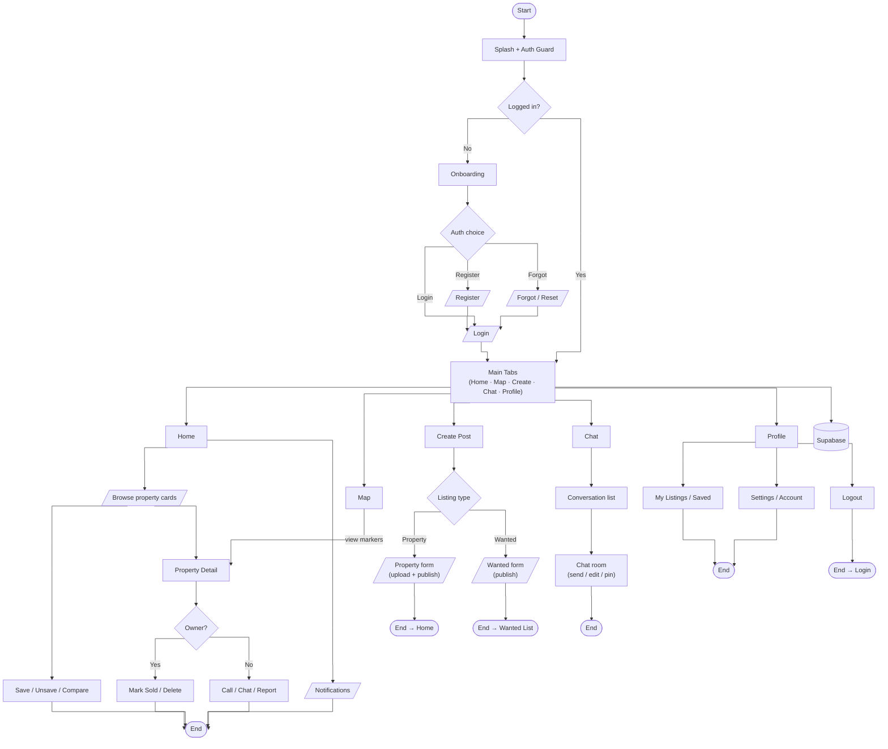

## Sequence diagram — auth ("Login / Register")

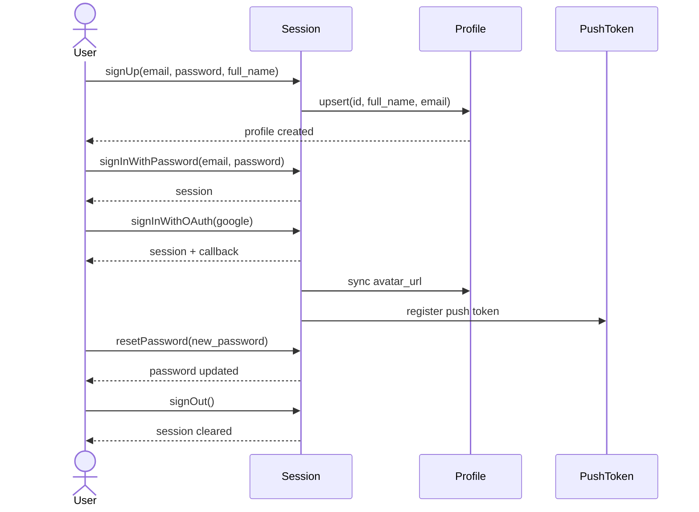

## Sequence diagram — home ("Browse / search", "Save / unsave", "Compare")

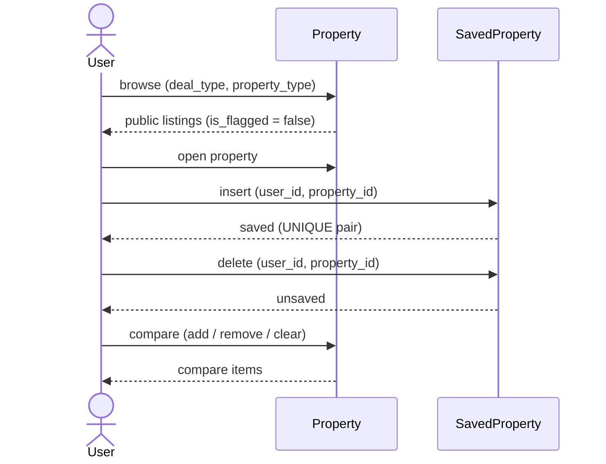

## Sequence diagram — search & map ("Search", "View map markers", "View property detail")

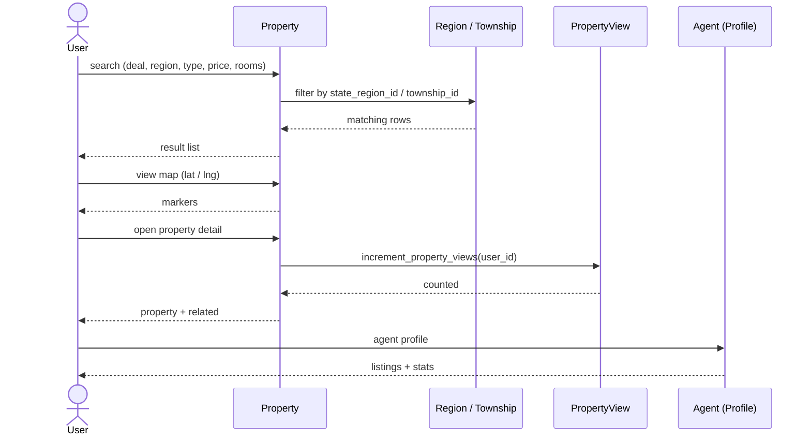

## Sequence diagram — property detail ("Call agent", "Flag & report", "Mark sold / delete")

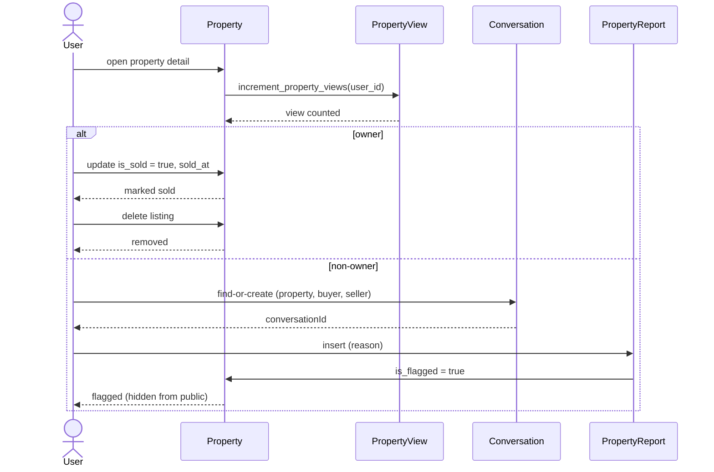

## Sequence diagram — create post ("Post property / hostel / wanted listing")

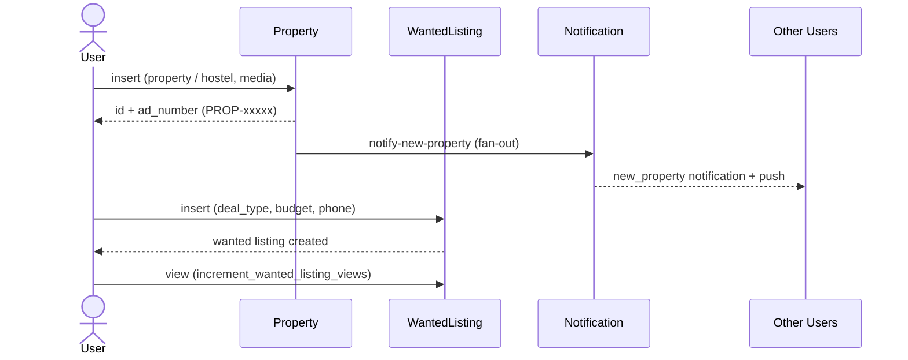

## Sequence diagram — chat ("Chat with agent / seller", "Respond via chat")

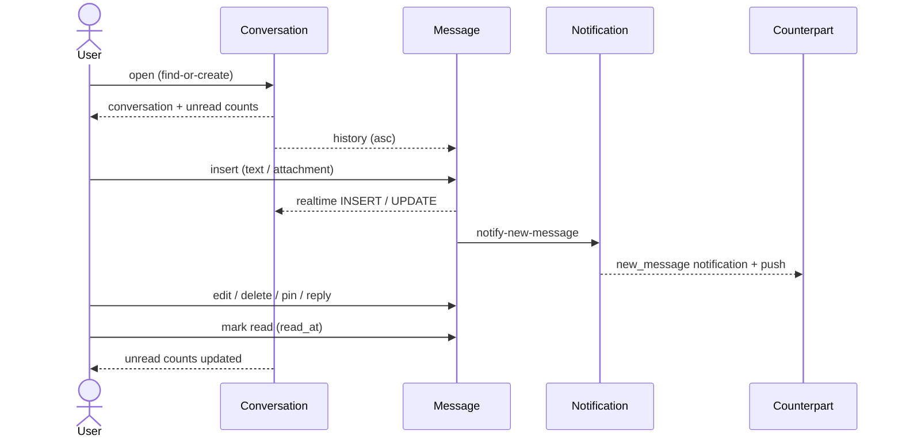

## Sequence diagram — profile ("Manage My Listings", "Manage profile", "Receive notifications")

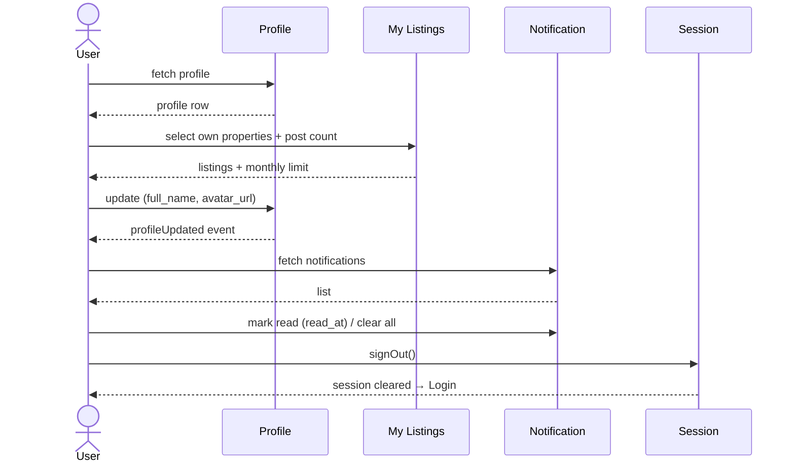

## Sequence diagram — seller process ("Post property / hostel listing", "Manage My Listings", "Mark sold / delete", "Respond via chat")

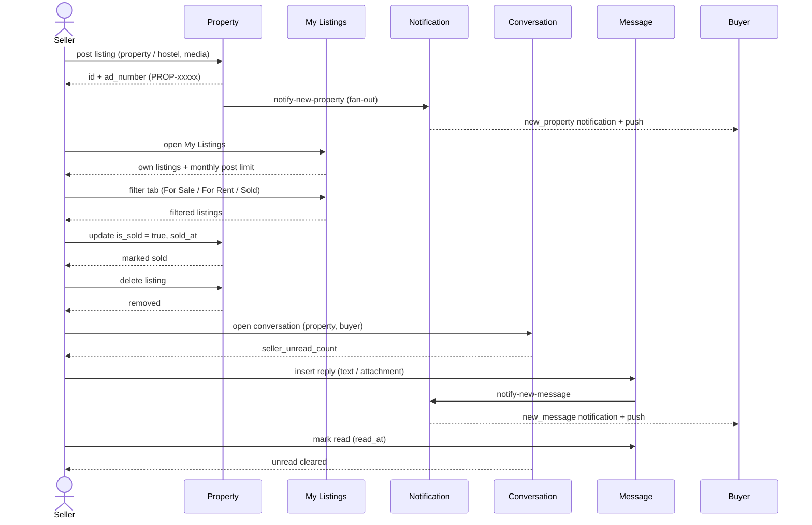

## Class diagram (Supabase tables)

The same schema as the ER diagram, drawn as a class diagram: each table is a class, its columns are attributes, and the PK/FK associations are class relationships.

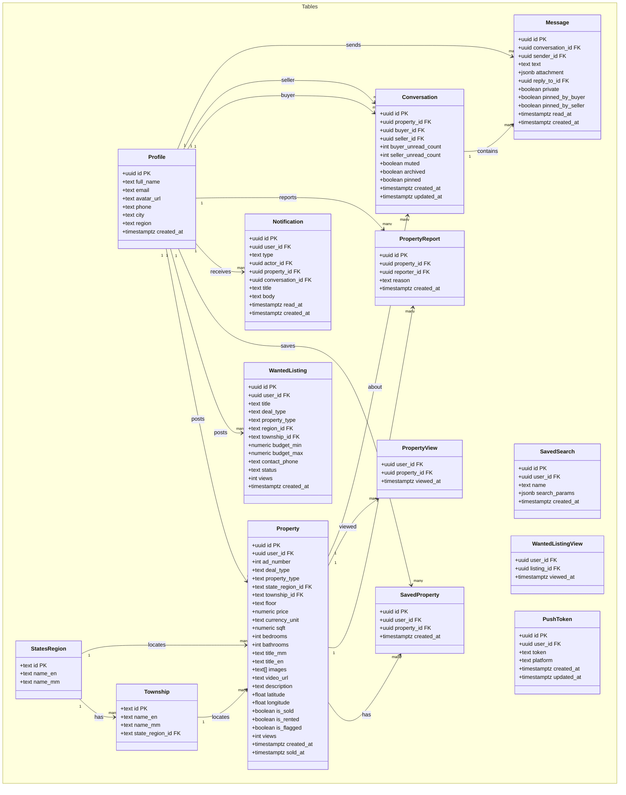

## ER diagram

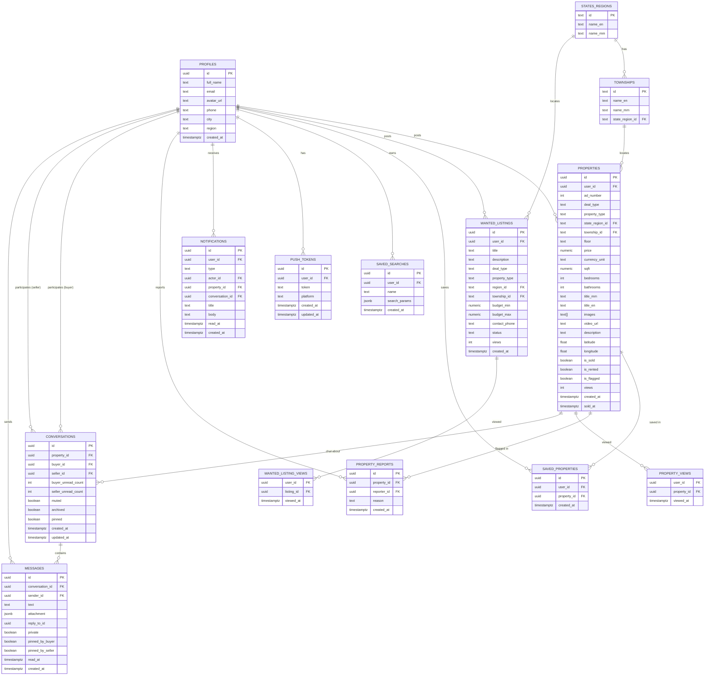

## Use case diagram

> GitHub Mermaid does not support the native `useCaseDiagram` type, so the use case model is rendered as a flowchart with actors on the left and use cases grouped inside the app system boundary.

