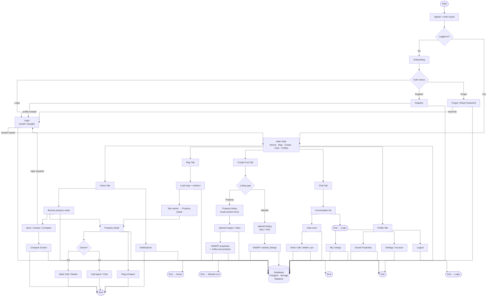
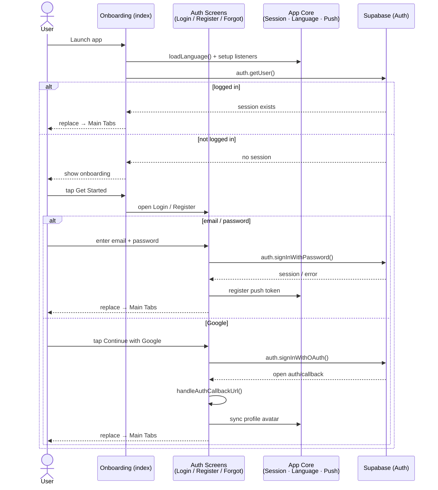
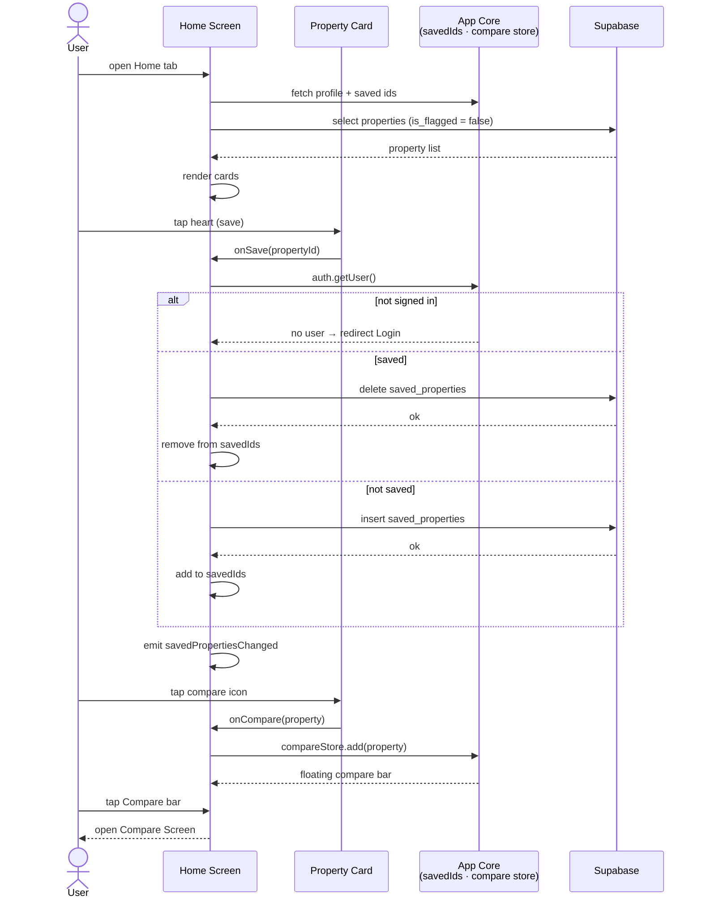
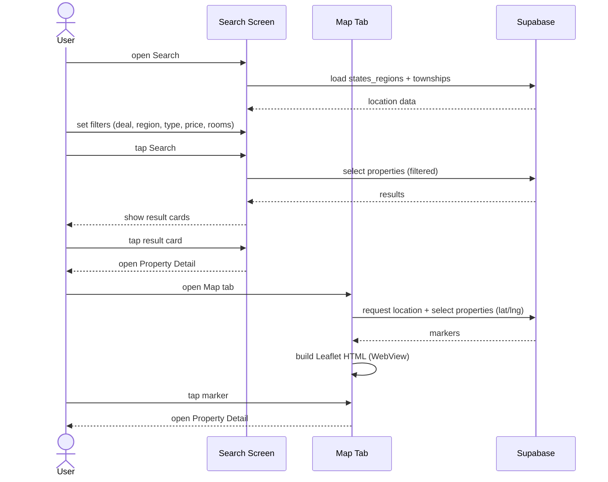
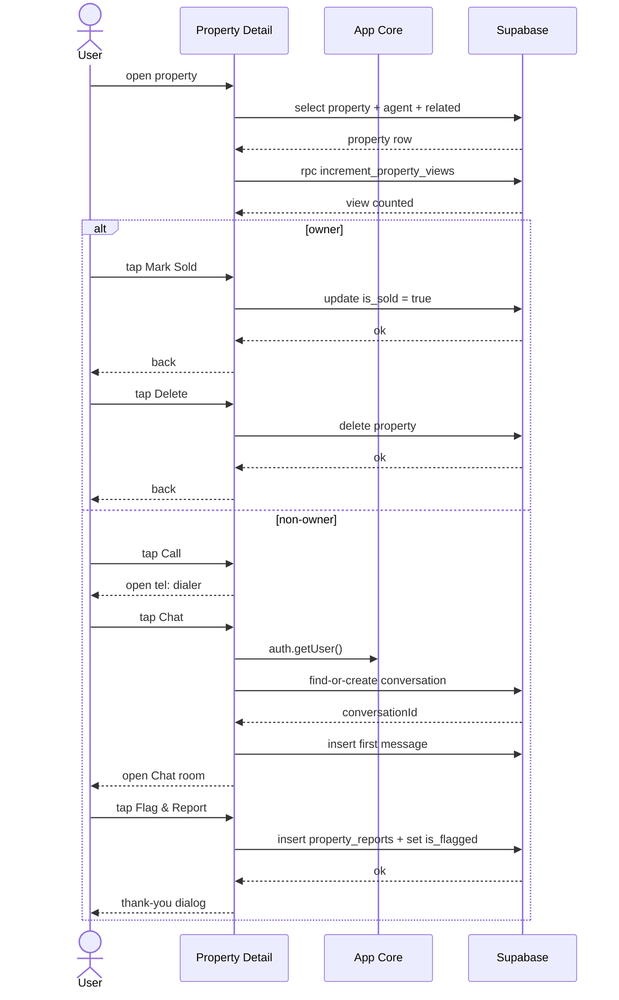
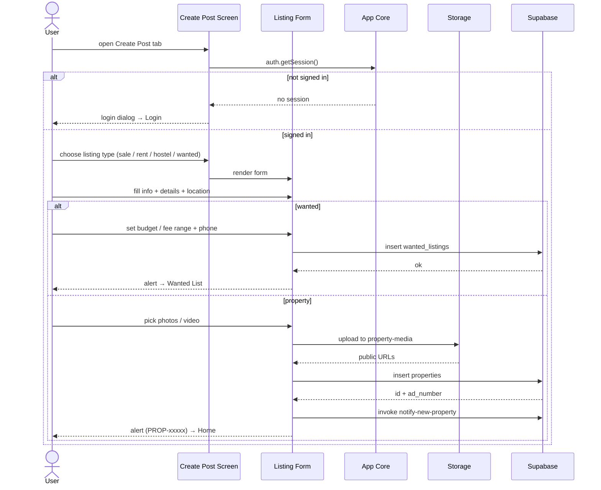
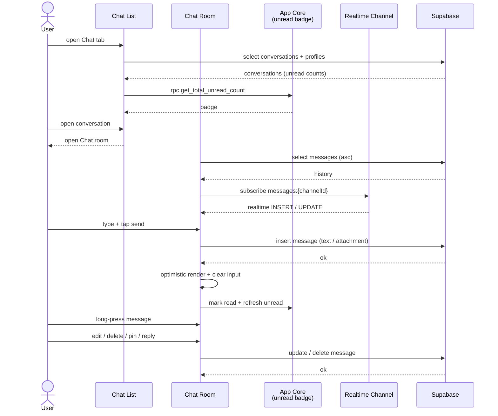
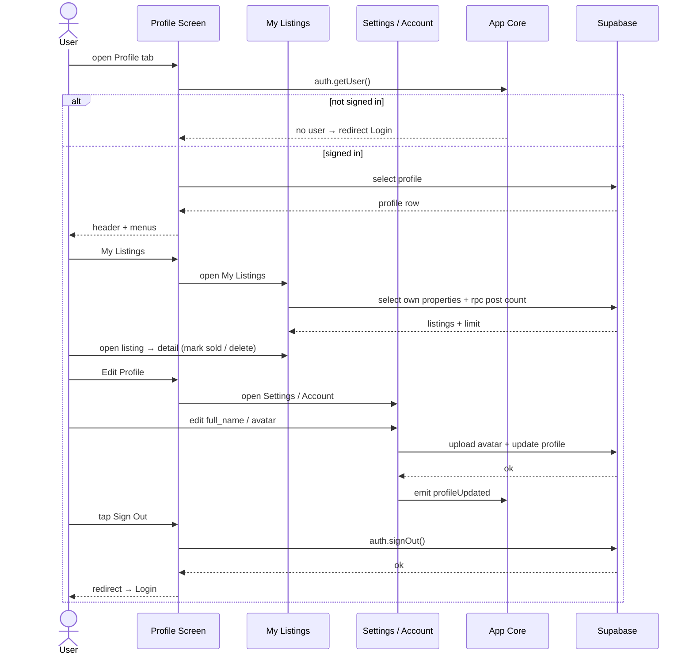
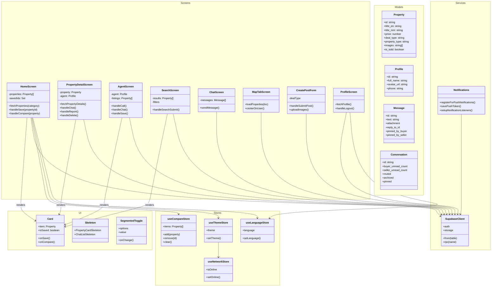

# Nest Finder — Diagrams

All diagrams for the Nest Finder (Expo React Native + Supabase) app. Each diagram lives as a standalone Mermaid `.mmd` file and is embedded below so GitHub renders it in this README.

| Diagram | File | Description |
| --- | --- | --- |
| Flow chart | [flowchart.mmd](./flowchart.mmd) | Full app flow with start / end states for every process |
| Sequence — auth | [sequence-auth.mmd](./sequence-auth.mmd) | Onboarding, login, register, forgot / reset password |
| Sequence — home | [sequence-home.mmd](./sequence-home.mmd) | Browse, save / unsave, compare, notifications |
| Sequence — search & map | [sequence-search.mmd](./sequence-search.mmd) | Filtered search, map markers, open detail |
| Sequence — property detail | [sequence-detail.mmd](./sequence-detail.mmd) | Views, owner actions, call / chat / report |
| Sequence — create post | [sequence-create.mmd](./sequence-create.mmd) | Property & wanted listing forms, upload, publish |
| Sequence — chat | [sequence-chat.mmd](./sequence-chat.mmd) | Conversation list, realtime room, message actions |
| Sequence — profile | [sequence-profile.mmd](./sequence-profile.mmd) | My listings, saved, settings, logout |
| Class diagram | [class.mmd](./class.mmd) | Main screens, stores, services, models (namespaces) |
| ER diagram | [er.mmd](./er.mmd) | Supabase database schema and relationships |
| Use case diagram | [usecase.mmd](./usecase.mmd) | Actors and use cases (rendered as a flowchart; GitHub Mermaid has no `useCaseDiagram` support) |

## Flow chart

## Sequence diagram — auth

## Sequence diagram — home (browse / save / compare)

## Sequence diagram — search & map

## Sequence diagram — property detail

## Sequence diagram — create post

## Sequence diagram — chat

## Sequence diagram — profile

## Class diagram

## ER diagram

## Use case diagram

> GitHub Mermaid does not support the native `useCaseDiagram` type, so the use case model is rendered as a flowchart with actors on the left and use cases grouped inside the app system boundary.

```mermaid
flowchart LR
    subgraph SYSTEM["📱 Nest Finder App (system boundary)"]
        direction TB
        subgraph G1["Guest use cases"]
            U1(("🔍 Browse / search properties"))
            U2(("🗺️ View map markers"))
            U3(("📄 View property detail"))
            U4(("🔑 Login / Register"))
        end
        subgraph G2["Buyer use cases"]
            U5(("💾 Save / unsave properties"))
            U6(("⚖️ Compare properties"))
            U7(("💬 Chat with agent / seller"))
            U8(("📞 Call agent"))
            U9(("🚩 Flag & report listing"))
            U10(("📋 Post wanted listing"))
            U11(("🔔 Receive notifications"))
        end
        subgraph G3["Owner / Seller use cases"]
            U12(("🏠 Post property listing"))
            U13(("🏢 Post hostel listing"))
            U14(("📂 Manage My Listings"))
            U15(("✅ Mark sold / delete"))
            U16(("💬 Respond via chat"))
        end
        subgraph G4["Any-user use cases"]
            U17(("🛠️ Manage profile & settings"))
            U18(("🌐 Switch language (EN / MM)"))
        end
    end
    A1(["👤 Guest"]) --> U1
    A1 --> U2
    A1 --> U3
    A1 --> U4
    A2(["👤 Buyer"]) --> U5
    A2 --> U6
    A2 --> U7
    A2 --> U8
    A2 --> U9
    A2 --> U10
    A2 --> U11
    A3(["👤 Owner / Seller"]) --> U12
    A3 --> U13
    A3 --> U14
    A3 --> U15
    A3 --> U16
    A4(["👤 Any user"]) --> U17
    A4 --> U18
```

